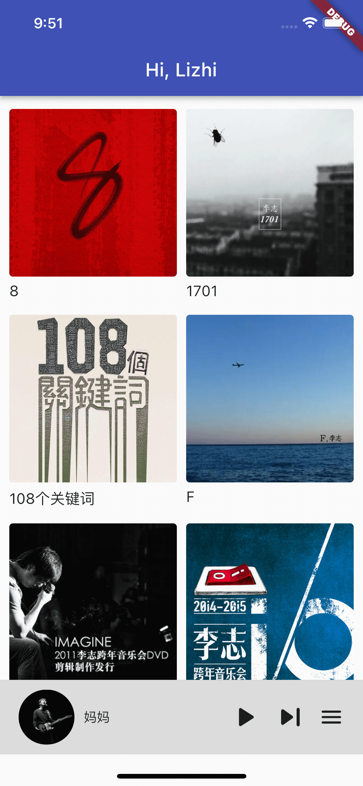
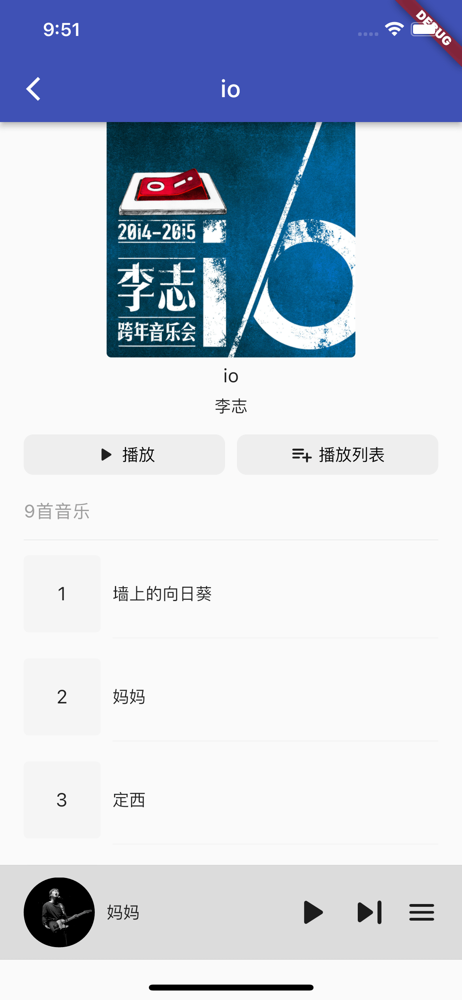
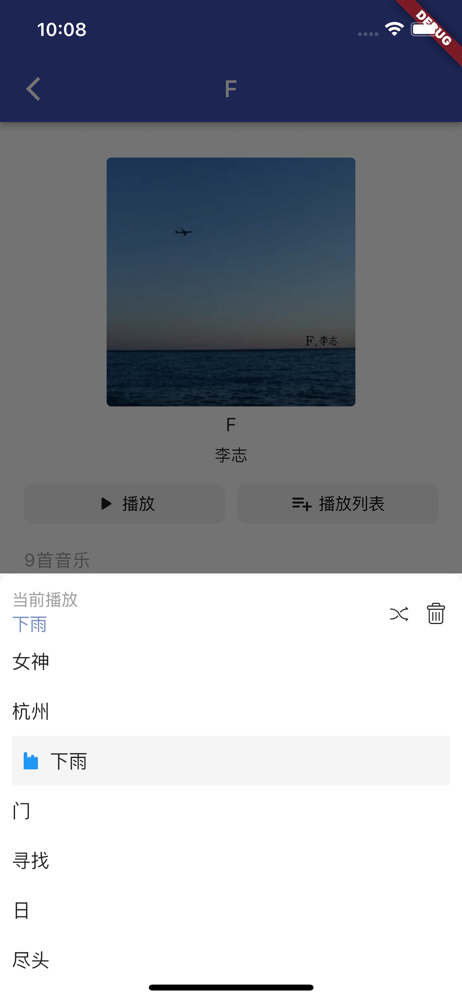

<h1 align="center">李志 · BB</h1>

开箱即用，一个基于Flutter开发的李志音乐作品集的在线播放器，支持Android、Ios

 

## 前言

  项目灵感来源于：[https://github.com/turkyden/lizhi](https://github.com/turkyden/lizhi)

## 预览  

<table>
  <tr>
    <td></td>
    <td></td>
    <td></td>
  </tr>
</table>

## 💿 作品专辑

| :zap: **LIVE**           | 💿 **专辑**           |
| :------------------------: | :------------------------: |
| 108 个关键词             | 8                        |
| io                       | 1701                     |
| 北京不插电               | 被禁忌的游戏             |
| 动静                     | 梵高先生                 |
| 二零零九年十月十六日事件 | 你好，郑州               |
| 工体东路没有人           | 我爱南京                 |
| 勾三搭四                 | F                        |
| 家                       | 这个世界会好吗           |
| 看见                     | 在每一条伤心的应天大街上 |
| 我们也爱南京             |                          |
| 广场                     |                          |
| 零碎                     |                          |

## 版权声明

版权全部归于李志先生所有，本人仅从互联网搜集资源进行合并整理。从李志公众号发布的声明来看，他也希望会得到传播，所以我个人贸然建立了此 Repository，并已发送邮件告知李志先生。若邮件回复不允许，我会立即删除。

[MIT](./LICENSE) & Copyright © 1998 - 2022 LiZhi. All Rights Reserveds.